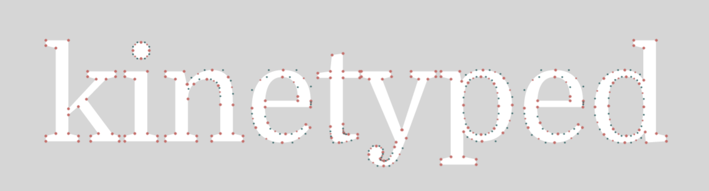

# p5.kinetyped &middot; [](https://github.com/mrehacek/kinetyped/blob/main/LICENSE)
A [_p5.js_](https://github.com/processing/p5.js) library for generative typography that allows you to convert text into points.



The library is written in TypeScript and uses [_opentype.js_](https://github.com/opentypejs/opentype.js) under the hood. It is meant as continuation of the old _geomerative_ library for Processing.

See also how a [whole app](https://github.com/mrehacek/kinetyped) can be based on that.

# Usage (installation)

### CDN

Insert following `<script>` tag to the head section of the HTML document (e.g. index.html):

```html
<head>
  ...
  <script
    src="https://cdn.jsdelivr.net/gh/mrehacek/p5.kinetyped@main/dist/p5.kinetyped.umd.js"
    type="text/javascript"
  ></script>
</head>
```

The functions of the library are then accessible in sketch under global variable **p5kt**, see examples below.

### Alternative method

If previous method doesn't work or you want to work offline:

- Open [this js file](https://github.com/mrehacek/p5.kinetyped/blob/main/dist/p5.kinetyped.umd.cjs) from _/dist_ folder of this repository.

- Create a new file in the p5 editor, _p5.kinetyped.js_, and paste there the code you downloaded. You could also just upload the file, but the editor has buggy uploads, it may freeze.

- Insert following `<script>` tag to the head section of the HTML document (e.g. index.html):

```html
<head>
  ...
  <script src="p5.kinetyped.js" type="text/javascript"></script>
</head>
```

## Functions

### _async_ `loadFont(fontPath: string)`

Load a font file from local path or URL asynchronously. Make _setup_ function async and call it inside there. See the code example below.

### _async_ `generateGlyphs(x: number, y: number, fontSize: number, text: string)`

Generate text glyphs ([path commands](https://github.com/opentypejs/opentype.js#path-commands)) as if rendered at position _x_ _y_ with _fontSize_. Doesn't return anything.

### `interpolateGlyphs(resolution: number)`

Interpolates a set of points along the glyph curves previously generated by _generateGlyphs()_. Doesn't return anything.

### `getPoints(): p5.Vector[]`

Get all points of the text. Returns an array of vectors.

### `getSeparatedPoints(): KT_Glyph[]`

When one wants to draw a text from shapes, we need to separate points from the letters (glyphs) from each other, and inside a glyph, have outer and inner points to create proper contouring.
Returns following object:

```js
{
  shape: p5.Vector[];
  contour: p5.Vector[];
  all: p5.Vector[];
}
```

## Demo

### Minimal examples:

#### Drawing points

```js
async function setup() {
  createCanvas(800, 300);
  await p5kt.loadFont(
    "https://fonts.gstatic.com/s/opensans/v34/memSYaGs126MiZpBA-UvWbX2vVnXBbObj2OVZyOOSr4dVJWUgsjr0C4nY1M2xLER.ttf"
  );
  await p5kt.generateGlyphs(50, 200, 145, "Kinetyped");
  p5kt.interpolateGlyphs(8);
}

function draw() {
  background(20);
  drawPoints(p5kt.getPoints());
}

function drawPoints(points) {
  push();
  noStroke();
  for (const v of points) {
    fill("white");
    circle(v.x, v.y, 3);
  }
  pop();
}
```

#### Drawing shapes

```js
draw() {
    ...
    fill(200, 40);
    // draw shapes, letter by letter
    for (const glyph of p5kt.getSeparatedPoints()) {
        drawShapeFromPoints(glyph);
    }
  ...
}

function drawShapeFromPoints(
  glyph // KT_Glyph
) {
  beginShape();
  // shape
  let shape_points = glyph.shape;
  for (const v of shape_points) {
    vertex(v.x, v.y);
  }
  // contour
  if (glyph.contour.length > 2) {
    beginContour();
    for (const v of glyph.contour) {
      vertex(v.x, v.y);
    }
    endContour();
  }
  endShape(CLOSE);
}
```

See at https://editor.p5js.org/mrehacek/sketches/TUHXzIESB.

You can see a more complex usecase with [Kinetyped](https://github.com/mrehacek/kinetyped), a Vue 3 application using this library as a generative tool, for parametrizing fonts by noise controlled by mouse interaction.

## Building the lib yourself

1. Install packages using [pnpm](https://pnpm.io/installation) inside the cloned directory:

   `pnpm i`

2. Run

   `vite build`

3. Folder `/dist` contains the built versions of the library:

   `p5.kinetyped.js` can be used with import statements (when using a package manager such as npm) while `p5.kinetyped.umd.cjs` can be included from html file.

## Licence

MIT
